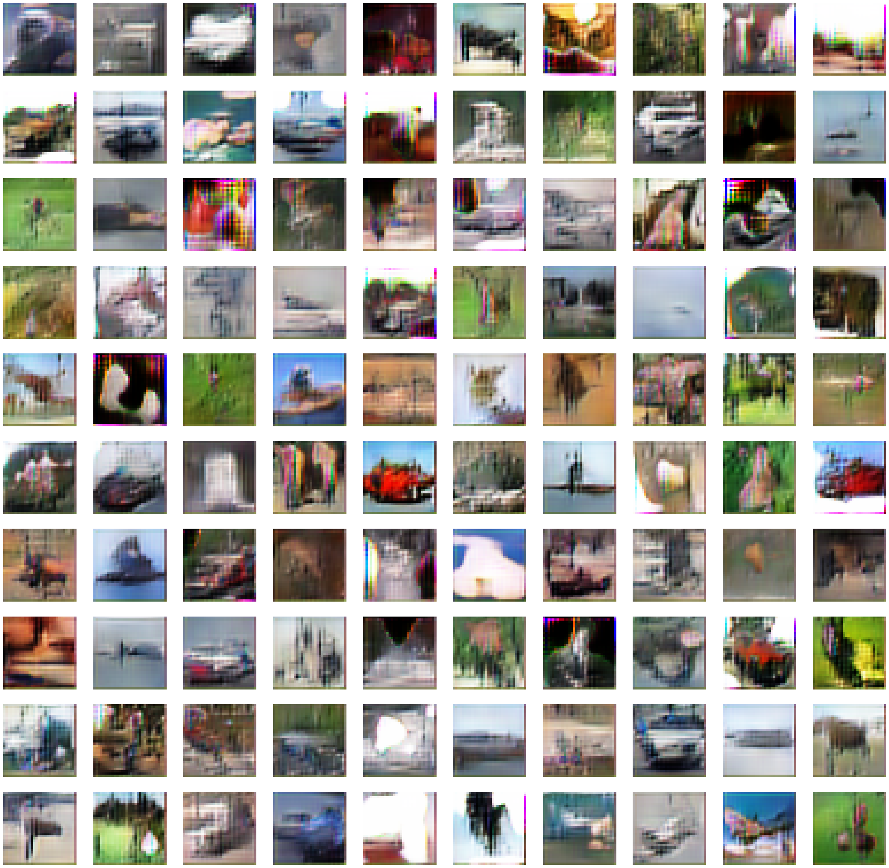
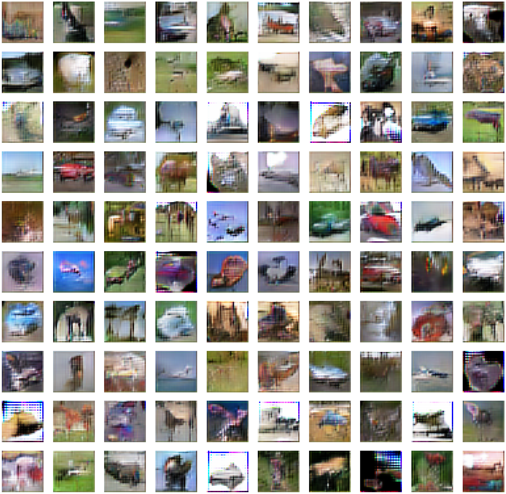
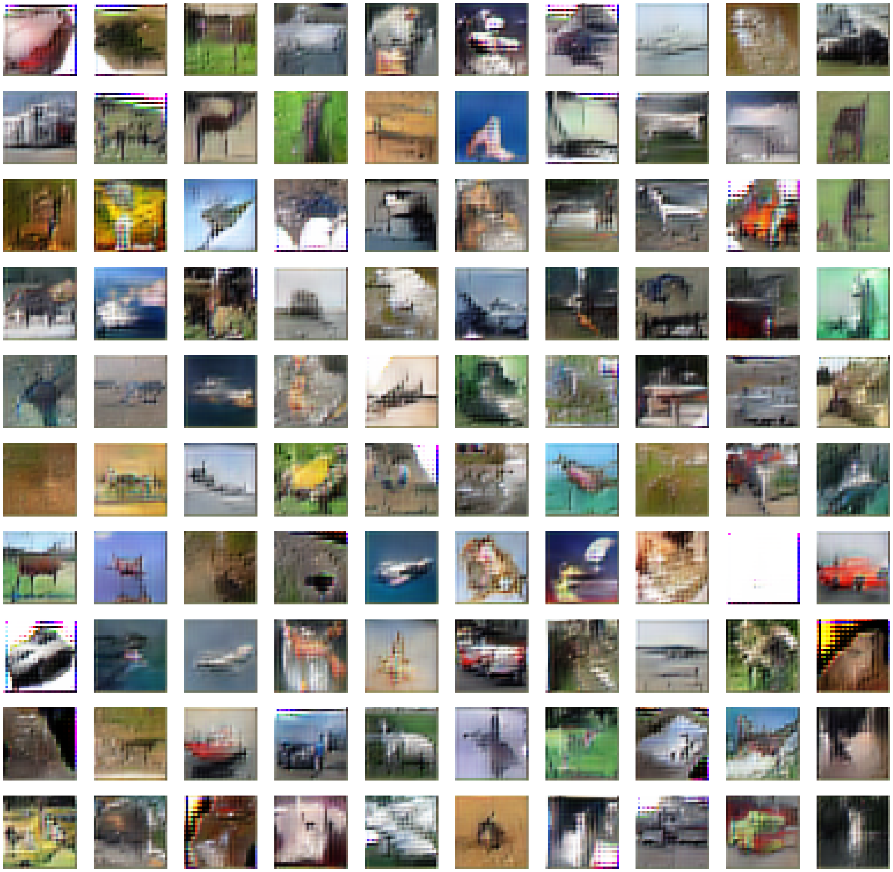
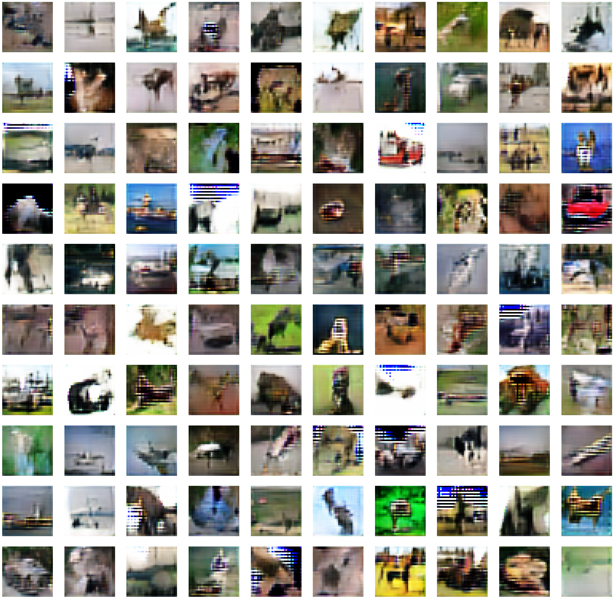
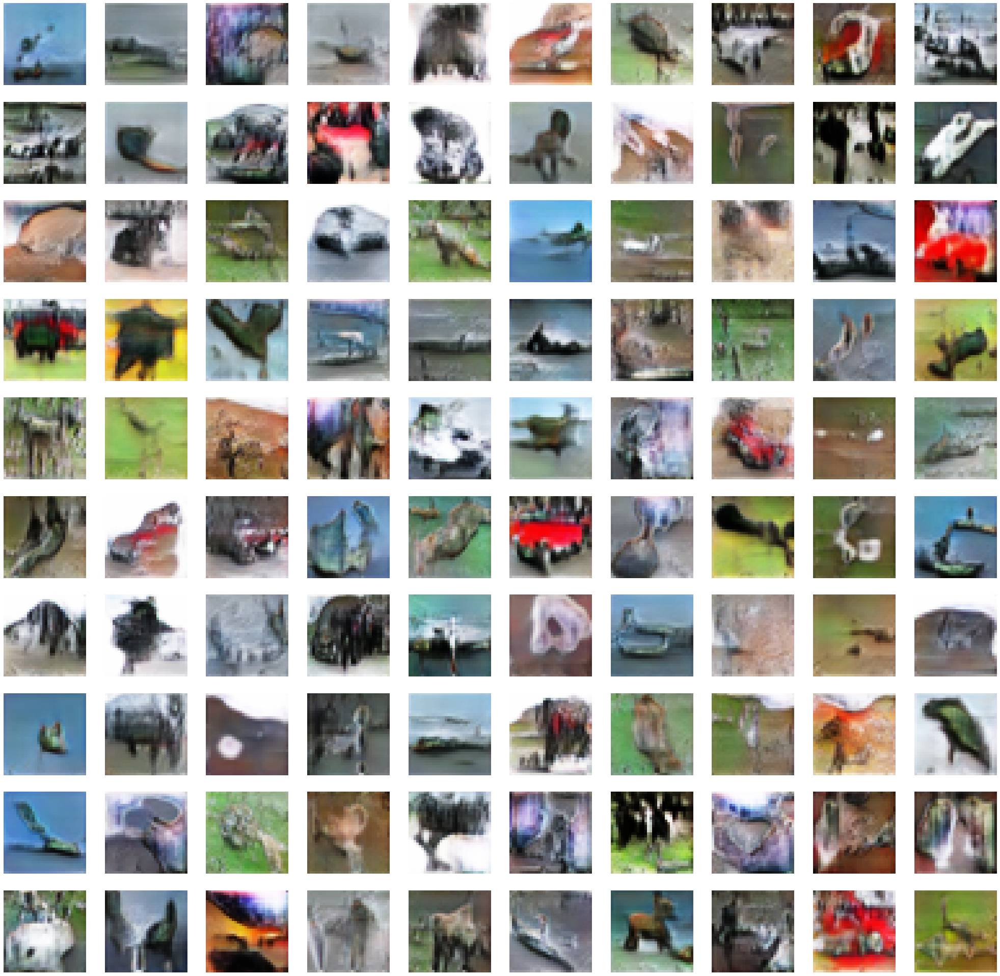
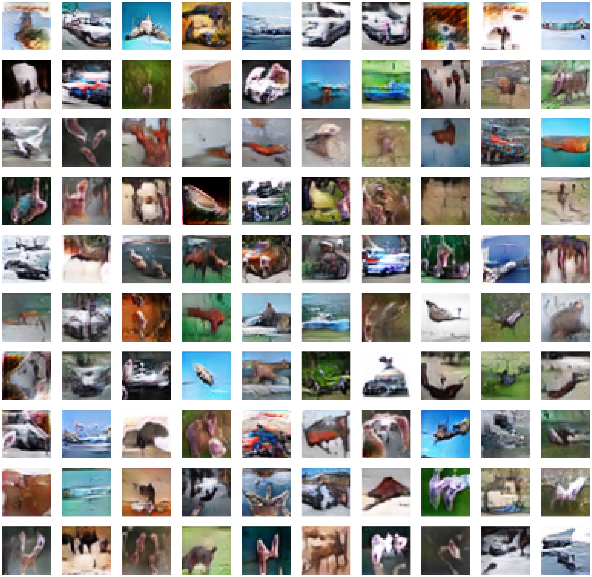
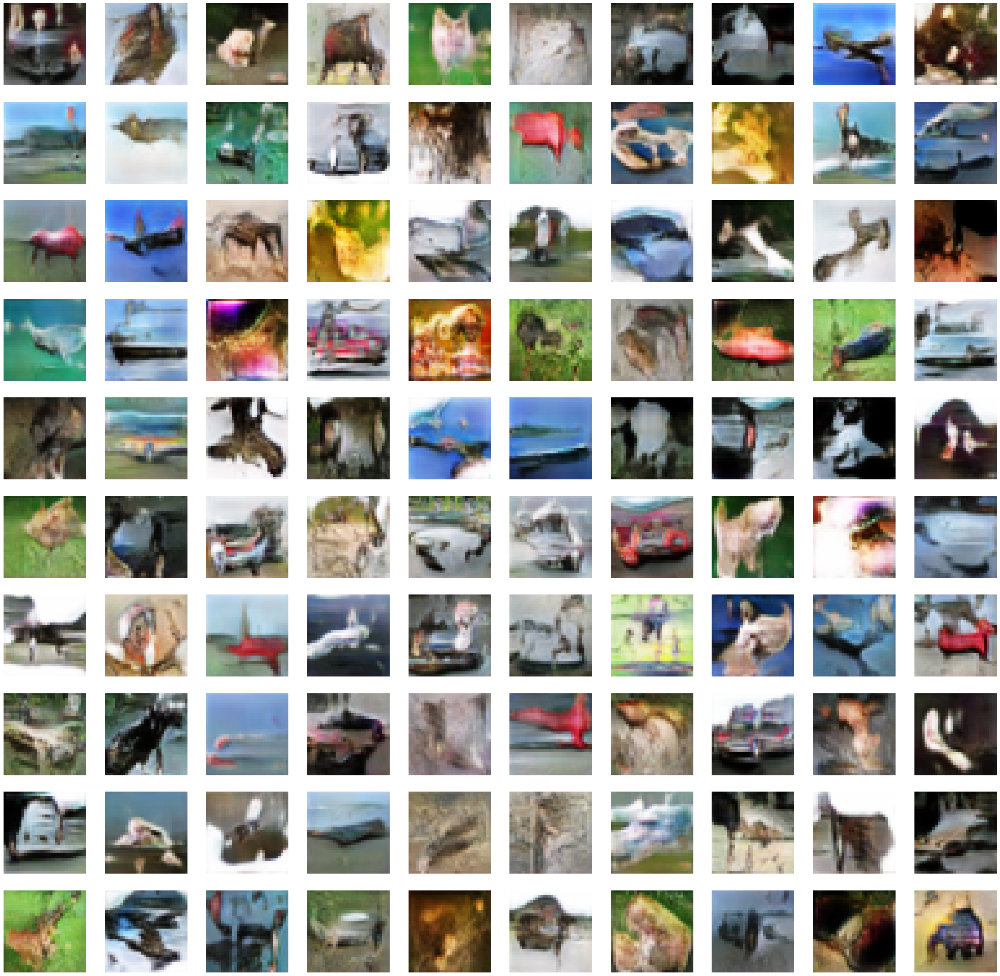
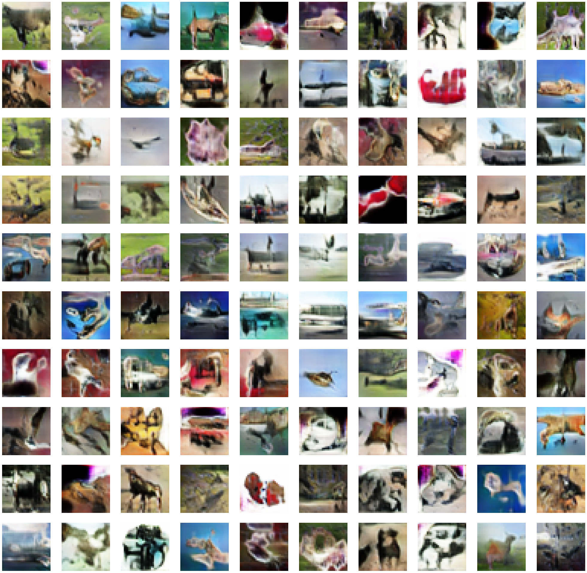
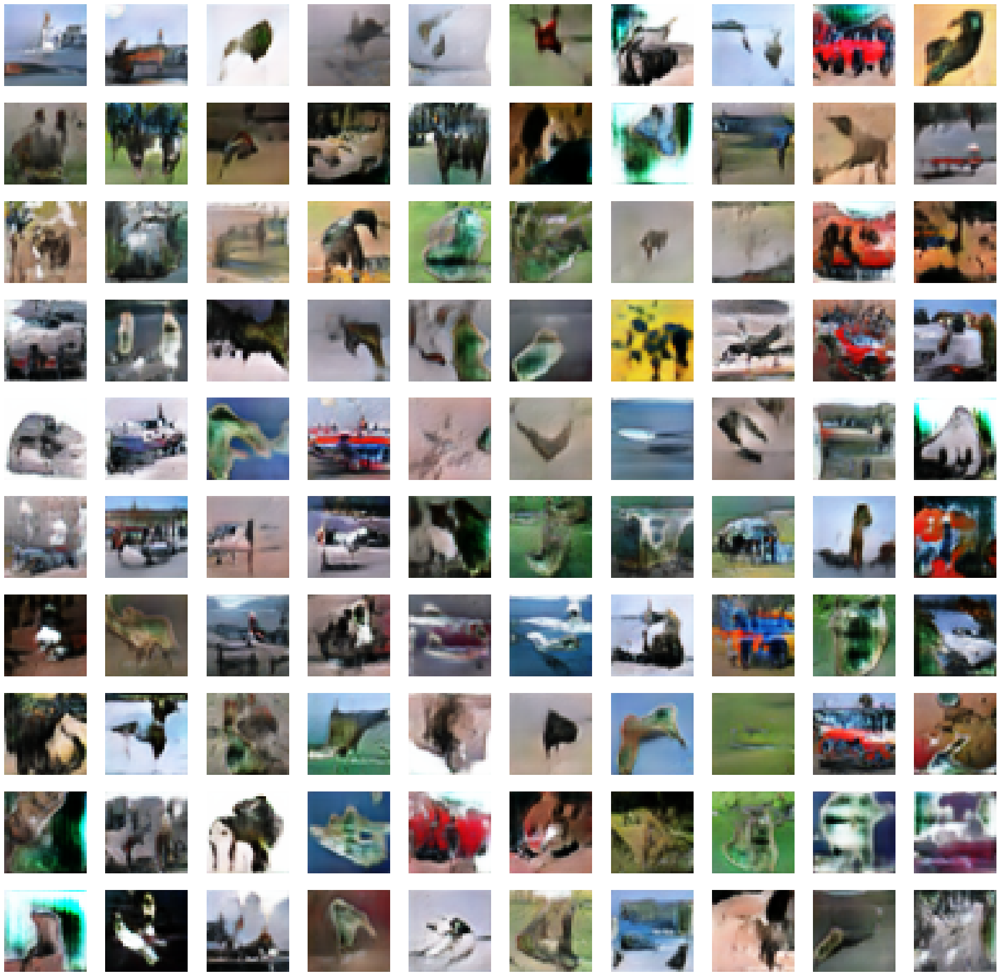
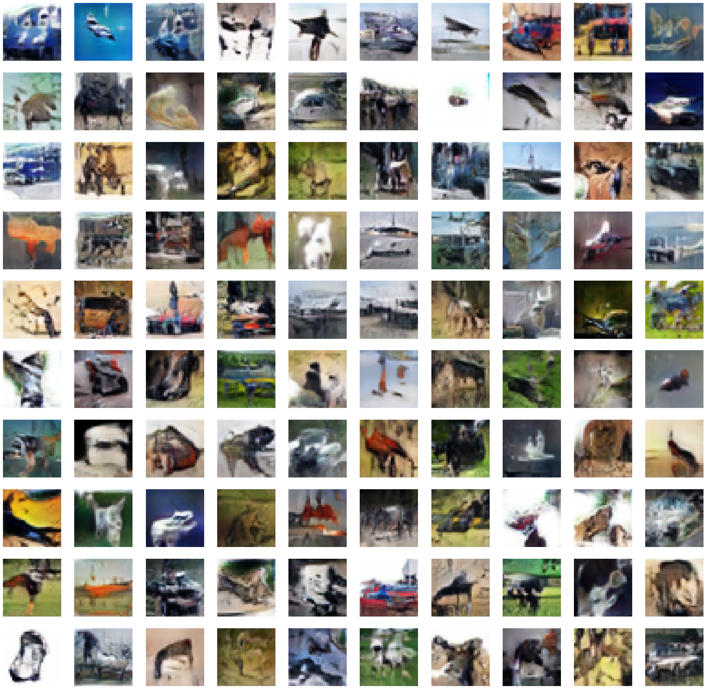

# WGAN-GP
implementation of WGAN with gradient penalty
# images while/after training
## image 1

## image 2

## image 3

## image 4

## image 5

## image 6

## image 7

## image 8

## image 9

## image 10

## image 11

